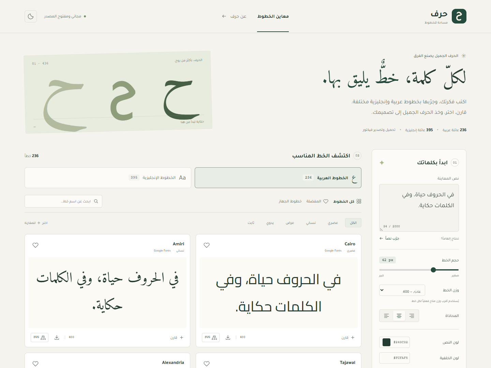
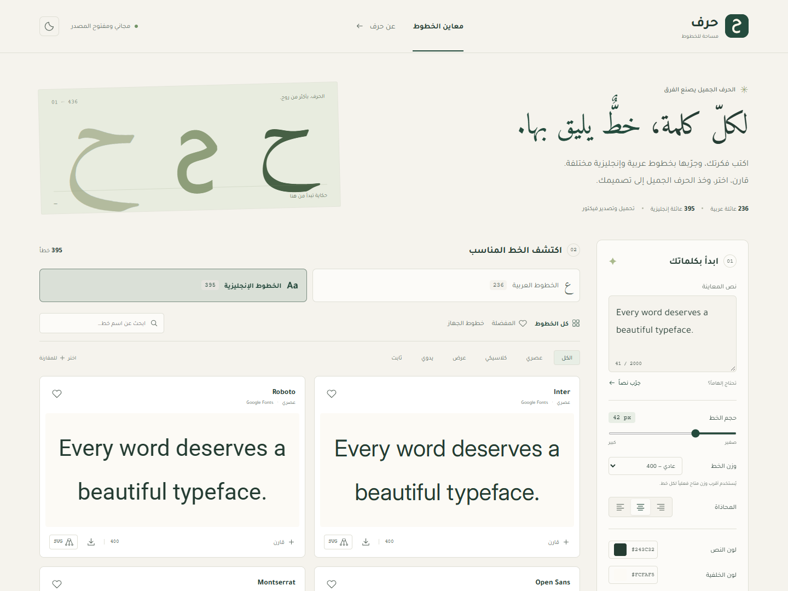

# حرف · Harf

**لكلّ كلمة، خطٌّ يليق بها.** مساحة مجانية مفتوحة المصدر لمعاينة الخطوط العربية والإنجليزية ومقارنتها، ثم أخذها إلى تصميمك.

[English](README.en.md) · [دليل المساهمة](CONTRIBUTING.md) · [الخصوصية](PRIVACY.md)



## ما الذي يقدّمه؟

- 236 عائلة تدعم العربية و395 عائلة تدعم الإنجليزية، بإجمالي 436 عائلة مختلفة. تظهر الخطوط التي تدعم اللغتين في القسمين.
- تبويب مستقل لكل لغة، مع نص معاينة محفوظ أثناء التنقل واتجاه RTL للعربية وLTR للإنجليزية.
- مكتبة Google Fonts، و179 عائلة عربية إضافية من مشاريع المصممين ومجموعات مفتوحة المصدر، بأوزانها ورخصها الأصلية.
- معاينة مباشرة للنص، وتحكم بالحجم والوزن والمحاذاة ولون النص والخلفية.
- بحث وتصنيفات، ومفضلة تحفظ محلياً، ومقارنة بين خطين إلى أربعة خطوط.
- الوصول الاختياري إلى خطوط الجهاز في المتصفحات الداعمة، واستيراد TTF وOTF وWOFF وWOFF2.
- تنزيل عائلة الخط كاملة في ZIP مع رخصتها.
- تصدير SVG بمسارات حقيقية عبر HarfBuzz، مع اتصال الحروف والتشكيل والنص المختلط. لا يحتاج الملف الناتج إلى تثبيت الخط.
- واجهة عربية RTL متجاوبة، ووضع داكن، ودعم لوحة المفاتيح وتقليل الحركة.
- لا حسابات، ولا مفاتيح API، ولا خدمات مدفوعة، ولا رفع للنصوص أو الملفات.

العدد مأخوذ من الفهرس المتحقق منه بتاريخ 30 سبتمبر 2026، وليس وعداً ثابتاً. يوجد 734 ملف خط في النسخة المرفقة؛ العائلات المتغيرة توفر عدة أوزان في ملف واحد. مصدر كل عائلة ونسخة مستودعها أو حزمتها وتغطيتها اللغوية مثبتة في [`src/data/fonts.json`](src/data/fonts.json). العائلات الإضافية تدعم العربية فعلياً؛ بعضها صُمّم أيضاً للفارسية أو الأويغورية. توضح [مراجعة المصادر](docs/catalog-sources.md) مصادر التوسعة وآلية استبعاد النسخ المكررة وغير الصالحة.

## التشغيل

يلزم **Node.js 24 أو أحدث** وnpm. من مجلد المشروع:

```bash
npm ci
npm run dev
```

افتح العنوان الذي يظهر في الطرفية. للإنتاج:

```bash
npm run build
npm run preview
```

يمكن استضافة محتويات `dist/` على أي استضافة ملفات ثابتة. يحتاج البناء إلى تثبيت التبعيات؛ ملفات الخطوط مرفقة ولا تُنزّل أثناء البناء. بعد وصول ملفات الموقع والخطوط إلى المتصفح لا تحتاج المعاينة والتصدير إلى خدمة خارجية؛ ليست هذه النسخة PWA ولا تضمن إعادة فتح الموقع دون شبكة.

## النشر على GitHub Pages

1. ارفع **محتويات هذا المجلد** إلى جذر مستودع مستقل. لا ترفع `node_modules` أو `dist`.
2. في **Settings → Pages → Build and deployment** اختر **GitHub Actions**.
3. من **Actions → Deploy to GitHub Pages → Run workflow** شغّل النشر.

يحدد workflow مسار المستودع تلقائياً، ويدعم مستودعات `username.github.io`. النشر يدوي حتى تقرر متى تصبح نسختك عامة. تعمل فحوص CI تلقائياً عند push وpull request إلى `main` أو `master`.

للاستضافة في مسار فرعي آخر، اضبط `VITE_BASE_PATH` قبل البناء، مثلاً `/harf/`. لا تضع أسراراً في متغيرات `VITE_*` لأنها تظهر في ملفات المتصفح.

## الخطوط المحلية

زر «اكتشف خطوط جهازك» يستخدم Local Font Access API عبر تفاعل صريح وإذن المتصفح، في HTTPS أو localhost. الدعم يختلف حسب المتصفح؛ Chrome وEdge على الكمبيوتر هما الخياران المعتادان. رفض الإذن لا يمنع الاستيراد اليدوي.

تُفحص حتى 500 عائلة وتُختار وجهة مستقيمة واحدة لكل عائلة، مع أوزانها المتغيرة إن وجدت. لا تُعرض مجموعات TTC أو الخطوط دون outlines مدعومة. نتحقق من وجود الألف والباء والميم للعربية، ومن الحروف الإنجليزية الكبيرة والصغيرة والأرقام للإنجليزية؛ يظهر تنبيه إذا كانت بعض أحرف النص غير مدعومة. لا يُسمح بالتصدير عند وجود أحرف مفقودة.

الحد الأقصى للاستيراد 20 ملفاً في المرة الواحدة و32 ميغابايت لكل ملف. تبقى الخطوط المحلية والمستوردة في الذاكرة وتُزال عند إعادة تحميل الصفحة. المفضلة لا تحفظ ملفات الخطوط.

## التصدير والرخص

SVG يحتوي على مسارات، وليس نصاً يعتمد على خط خارجي. التصدير **أحادي اللون**، حتى لو كان الخط الملون يدعم أكثر من لون. يحافظ على الأسطر التي أدخلتها؛ التفاف البطاقات تلقائياً لا يصبح أسطراً في الملف الناتج. مساحة الرسم تراعي extents والتشكيل، والخلفية شفافة اختيارياً.

كود التطبيق برخصة [MIT](LICENSE). رخص الخطوط **مستقلة** وموجودة بجانب الملفات في `public/fonts/` ومرفقة بالتنزيل. تتضمن عائلات المجموعات الإضافية إشعاراتها الأصلية والمصدر المقابل ووصفات بناء الحزمة من `public/font-sources/`، بما فيها استثناءات تضمين الخطوط حيث تنص الرخصة عليها. وجود خط على الجهاز لا يعني أنه مجاني؛ تأكد من حق استخدامه وتصديره. تنطبق رخص HarfBuzz وbidi-js وwoff-lib وJSZip وReact وبقية التبعيات على تلك المكونات؛ راجع [إشعارات الطرف الثالث](THIRD_PARTY_NOTICES.md).

ست عائلات من Alif Type مرخّصة برخصة AGPL-3.0، وتظهر رخصتها على البطاقة. تتضمن تنزيلاتها مصادر الخطوط القابلة للتحرير وملفات البناء والإشعارات الأصلية، ويحتوي SVG على نص رخصة الخط وإشعاراته ورابط مصدره. حزم مصادر الخطوط تستبعد الصور المرجعية وملفات PDF؛ تبقى روابط صور خلفيات المحرر داخل المصادر كما نشرها المصمم، ويمكن الرجوع إلى مستودعه الأصلي لها. بقية الرخص الأصلية، ومنها OFL وApache وBitstream ورخص الحزم الكلاسيكية، مستقلة كذلك عن MIT الخاصة بالتطبيق.

## تحديث الفهرس

```bash
npm run fonts:sync
npm test
npm run build
```

يقرأ البرنامج فهرس Google Fonts الرسمي، ويختار العربية و200 عائلة إضافية تدعم الإنجليزية، ويثبت commit واحداً من `google/fonts`. ويضم مصادر مستقلة مسجلة في `scripts/open-font-sources.mjs` مع revision مثبت لكل مستودع وملفات الرخص الأصلية والإشعارات الإضافية.

ثم يقرأ مجموعات الخطوط من حزم Debian الرسمية المثبتة في `scripts/debian-font-sources.mjs`. يتحقق من سلامة أرشيفات المصدر عبر SHA-256، ويحفظها مع إشعارات المصمم ووصفات البناء. تُفحص تغطية العربية والتشكيل واتصال الحروف والمسارات من الملفات نفسها؛ تُستبعد الملفات المكررة والوجوه غير الداعمة. يتطلب تحديث هذه الحزم أداة `tar` الداعمة لـ xz؛ تُستخدم نسخة Windows المرفقة بالنظام عند التشغيل عليه.

تُضاف المصادر المنتقاة في `scripts/curated-font-sources.mjs` بإصدارات مستودعات وأرشيفات ثابتة. يتحقق البرنامج من SHA-256 للملفات والأرشيفات، ويقارن بصمة مسارات الحروف العربية والمسافات لمنع تكرار التصميم بأسماء مختلفة. تحفظ رخص Layla وKurinto الكاملة من بيانات الخط الأصلية في ملفات نصية قابلة للقراءة. يجلب ملفات Kurinto المحددة بنطاقات بايتات ويتحقق من بصمتها دون تحميل حزمة المجموعة كاملة.

يلزم اتصال بالشبكة وقد تطبق GitHub حدود طلبات غير موثقة. راجع تغييرات الخطوط والرخص قبل قبولها. لا تُحذف الملفات القديمة تلقائياً. تشغيل التطبيق لا يتصل بـ Google أو GitHub أو Debian للحصول على خطوط.

## التحقق

```bash
npm run typecheck
npm test
npx playwright install chromium
npm run test:e2e
npm run build
```

إذا أردت استخدام Chrome المثبت بدلاً من تنزيل Chromium، عيّن `PLAYWRIGHT_CHANNEL=chrome`. راجع [`tests/`](tests/) لاختبارات تغطية العربية والرخص، تشكيل الحروف وSVG، ودورات الاستخدام في المتصفح.

## بنية المشروع

```text
src/components/    بطاقات الخطوط والنوافذ والأيقونات
src/lib/           تحميل الخطوط، التحقق، bidi، SVG والتنزيل
src/data/          الفهرس المثبت
public/fonts/      ملفات الخطوط الأصلية ورخصها
public/font-sources/ مصادر مجموعات الخطوط ووصفات بنائها وإشعاراتها
scripts/           مزامنة الفهرس والتقاط صور الواجهة
tests/             اختبارات الوحدة والمتصفح
.github/           CI، نشر Pages وقوالب البلاغات
```

اقتراحات وتحسينات الخطوط العربية مرحب بها. أرفق اسم الخط وعينة نص ونسخة المتصفح مع أي بلاغ عن مشكلة تشكيل.

## مصادر الخطوط العربية الإضافية

تتضمن المكتبة Shabnam وSahel وSamim وTanha وGandom وNahid من [Saber Rastikerdar](https://github.com/rastikerdar)، و[Arad](https://github.com/MohamadDarvishi/Arad)، و[FiraGO](https://github.com/bBoxType/FiraGO)، و[Kawkab Mono](https://github.com/aiaf/kawkab-mono)، ونسختي Noto Arabic UI من [Noto Fonts](https://github.com/notofonts/noto-fonts). ملفات الخطوط الأصلية غير معدلة، وتنزيل كل عائلة يتضمن رخصتها وإشعارات التراخيص الإضافية عند الحاجة.

وتضيف مجموعات [Arabeyes](https://www.arabeyes.org/Fonts) وKACST و[UKIJ](https://ukij.org/fonts/) و[PakType](https://paktype.sourceforge.net/) وFarsiWeb وThabit وGNU FreeFont وDejaVu تنوعاً أوسع في النسخي والكوفي والزخرفي وأشكال العرض. تأتي النسخ المرفقة من [أرشيف Debian الرسمي](https://deb.debian.org/debian/pool/main/f/)، مع المصدر والرخص والإشعارات الأصلية داخل المشروع وتنزيل العائلة.


